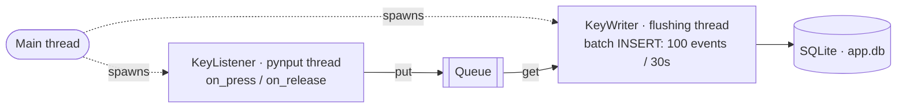

# KeyboardLogger

A lightweight personal keyboard activity tracker that runs silently in the background and logs keystroke statistics to a local SQLite database — for later analysis, heatmaps, and frequency distributions.

> **Personal use only.** This tool is designed to collect your own typing statistics on your own machine.

---

## What it does

- Intercepts all keyboard events system-wide using `pynput`
- Filters out key-repeat events (auto-repeat from holding a key)
- Normalizes keys to stable Virtual Key codes (independent of modifiers like Shift/Ctrl)
- Buffers events in memory and flushes to SQLite in batches
- Tracks sessions (start/end time, hostname)
- Runs silently in the background via `pythonw.exe` with no console window

---

## Architecture




**Three modules:**

- `key_listener.py` — Wraps `pynput.keyboard.Listener`. Normalizes keys to `vk_{code}` format, filters auto-repeat using a set of currently-pressed keys, puts events into a shared `Queue`.
- `key_writer.py` — Runs in a dedicated thread. Reads from the queue and flushes to SQLite in batches (every 100 events or every 30 seconds, whichever comes first). Handles graceful shutdown via `threading.Event`.
- `connection.py` — Opens a SQLite connection, applies schema, sets WAL mode and foreign keys pragma, manages schema versioning via `PRAGMA user_version`.

---

## Database schema

```sql
sessions       -- one row per program run
  id, started_at, ended_at, hostname

key_events     -- one row per keypress or release
  id, session_id, event_time, key_name, event_type
```

---

## Tech stack

- **Python 3.12**
- **pynput** — global keyboard hook
- **sqlite3** — standard library, no ORM
- **threading** — background flush thread
- **pywin32** — Windows named mutex (single-instance guard)

---

## Running

```bash
# Install dependencies
pip install pynput pywin32

# Run with console (development)
python main.py

# Run without console (background)
pythonw.exe main.py
```

---

## Autostart (Windows)

Configured via **Task Scheduler** (`taskschd.msc`):
- Trigger: At log on of any user
- Action: `pythonw.exe main.py` with `Start in` set to the project folder
- Settings: restart on failure, no AC power requirement

---

## Planned

- Analysis script: frequency distribution, keyboard heatmap, activity by time of day
- Digraph analysis (most common key pairs)